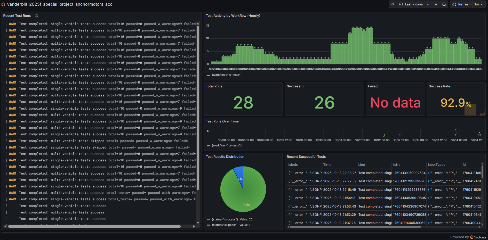

# CI/CD Reference - GitHub Actions & Grafana

Quick reference for the configured GitHub Actions workflows and Grafana Cloud monitoring.



Link to publick Dashboard:

https://pmq9.grafana.net/public-dashboards/09e1212bd2f5467d9a5c53ad9e4237c3

## Table of Contents
- [Workflows Overview](#workflows-overview)
- [Creating Dashboards](#creating-dashboards)
- [Useful Queries](#useful-queries)
- [Troubleshooting](#troubleshooting)

---

# Workflows Overview

Two automated workflows are running:
- **Weekly Tests** ([weekly-tests.yml](workflows/weekly-tests.yml)) - Every Monday at 9:00 AM UTC
- **PR Tests** ([pr-tests.yml](workflows/pr-tests.yml)) - On PRs to master/main/develop

Both workflows:
- Run single and multi-vehicle tests in parallel
- Upload test results as artifacts
- Send logs to Grafana Cloud Loki

## Manually Trigger Weekly Tests

1. Go to **Actions** → **Weekly Automated Tests**
2. Click **Run workflow** → Select branch → **Run workflow**

## GitHub Secrets (Already Configured)

| Secret | Purpose |
|--------|---------|
| `GRAFANA_LOKI_URL` | Loki push endpoint |
| `GRAFANA_LOKI_USERNAME` | Numeric User ID |
| `GRAFANA_LOKI_API_KEY` | Service account token |

---

# Creating Dashboards

## Quick Dashboard Setup

### 1. Create New Dashboard
Grafana → **Dashboards → New → New Dashboard** → **Add visualization** → Select **Loki**

### 2. Add Key Panels

**Panel 1: Recent Test Runs (Logs)**
- Type: Logs
- Query: `{job="github-actions"}`

**Panel 2: Success Rate (Stat)**
- Type: Stat
- Query:
  ```logql
  sum(count_over_time({job="github-actions", status="success"}[24h]))
  /
  sum(count_over_time({job="github-actions"}[24h])) * 100
  ```
- Unit: Percent (0-100)
- Thresholds: Red (0-70), Yellow (70-90), Green (90-100)

**Panel 3: Test Runs Over Time (Time Series)**
- Type: Time series
- Query: `sum(count_over_time({job="github-actions"}[5m])) by (workflow)`

**Panel 4: Failed Tests (Table)**
- Type: Table
- Query: `{job="github-actions", status="failure"} | json`

### 3. Save Dashboard
Click **Save** (disk icon) → Name: "GitHub Actions Tests"

---

# Useful Queries

## Basic Queries

```logql
# All test runs
{job="github-actions"}

# Failed tests only
{job="github-actions", status="failure"}

# Successful tests
{job="github-actions", status="success"}

# Specific workflow
{job="github-actions", workflow="pr-tests"}

# Specific test type
{job="github-actions", test_type="single-vehicle"}

# Specific branch
{job="github-actions", branch="master"}
```

## Aggregate Queries

```logql
# Test counts by workflow
sum(count_over_time({job="github-actions"}[1h])) by (workflow)

# Test counts by type
sum(count_over_time({job="github-actions"}[1h])) by (test_type)

# Failure rate by workflow
sum(count_over_time({job="github-actions", status="failure"}[24h])) by (workflow)

# Success count last 7 days
sum(count_over_time({job="github-actions", status="success"}[7d]))
```


---

## Data Collected

Each test run sends a log entry with these labels:

- `job`: "github-actions"
- `workflow`: "pr-tests" or "weekly-tests"
- `test_type`: "single-vehicle" or "multi-vehicle"
- `repository`: Your repo name
- `branch`: Branch name
- `event`: "pull_request", "schedule", or "workflow_dispatch"
- `status`: "success" or "failure"

Use these labels to filter and aggregate your data.

## Resources

- [GitHub Actions Docs](https://docs.github.com/en/actions)
- [Grafana Cloud Docs](https://grafana.com/docs/grafana-cloud/)
- [LogQL Query Language](https://grafana.com/docs/loki/latest/query/)
