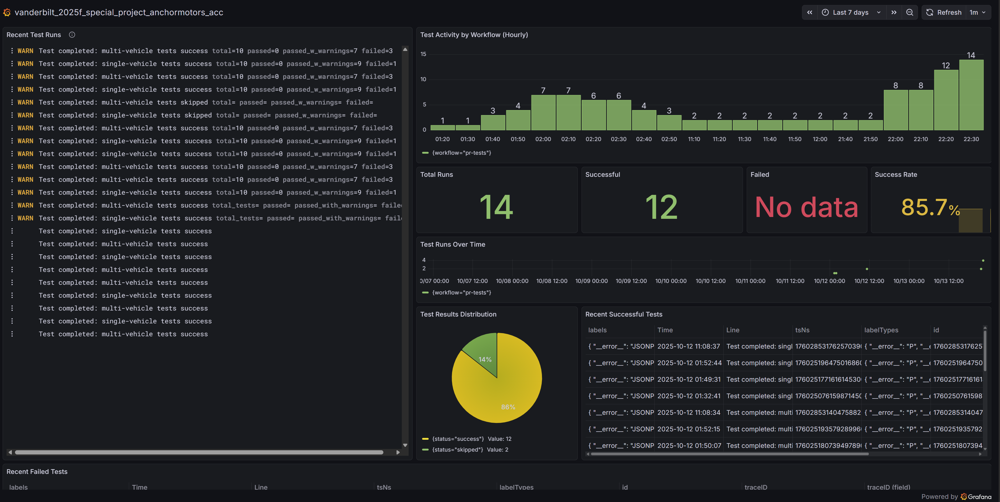

# anchormotors project

# User Manual

## Requirements
- MATLAB 2025a
- Required Toolboxes:
  - Simulink
  - MATLAB Report Generator
  - Control System Toolbox
  - Simulink Control Design
  - DSP System Toolbox

## Automated Testing

Run all test cases automatically with timestamped PDF reports and plots.

### Local Testing

**Single Vehicle Tests:**
- **Headless (Windows)**: Double-click `test/single_veh_test/run_tests.bat`
- **MATLAB Console**: Run `test/single_veh_test/run_all_single_test.m`
- **Results**: `test/single_veh_test/results/test_report_YYYYMMDD_HHMMSS.pdf`

**Multi Vehicle Tests:**
- **Headless (Windows)**: Double-click `test/multi_veh_test/run_tests.bat`
- **MATLAB Console**: Run `test/multi_veh_test/run_all_multi_test.m`
- **Results**: `test/multi_veh_test/results/test_report_YYYYMMDD_HHMMSS.pdf`

### CI/CD Pipeline (GitHub Actions + Grafana)

The project includes automated testing through GitHub Actions with real-time monitoring:

- **Pull Request Tests**: Automatically run on PRs to `master`, `main`, `develop` branches
- **Weekly Tests**: Scheduled runs every Monday at 9:00 AM UTC
- **Real-time Monitoring**: Test results and metrics are streamed to Grafana Cloud dashboards
- **Artifact Storage**: PDF reports and test results available as workflow artifacts

**Key Features:**
- Parallel execution of single and multi-vehicle tests
- Automated test result analysis and reporting
- Historical test performance tracking
- Bypass capability for emergency merges (`ALLOW_PR_CI_TEST_BYPASS`)

**View Dashboard**: [Public Grafana Dashboard](https://pmq9.grafana.net/public-dashboards/09e1212bd2f5467d9a5c53ad9e4237c3)

For detailed CI/CD setup and troubleshooting, see [CI_CD_SETUP.md](CI_CD_SETUP.md).

**Setup Requirements:**
- **To Workspace** blocks to Simulink models (Format: `Structure with Time`)
- MATLAB Report Generator toolbox

**Report Contents:**
- Pass/fail summary for all test cases
- Individual test results with plots
- Captured warnings and errors from simulation