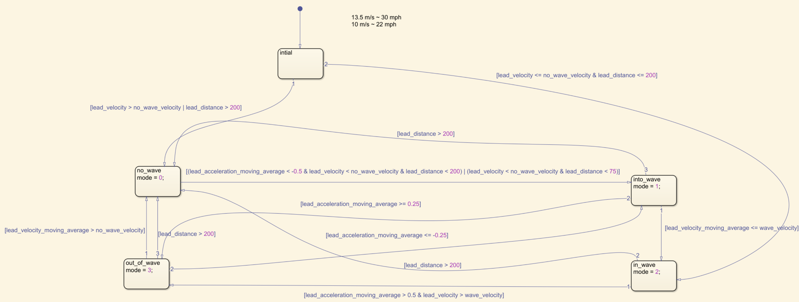
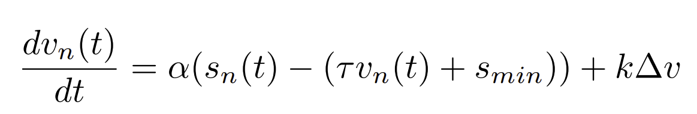
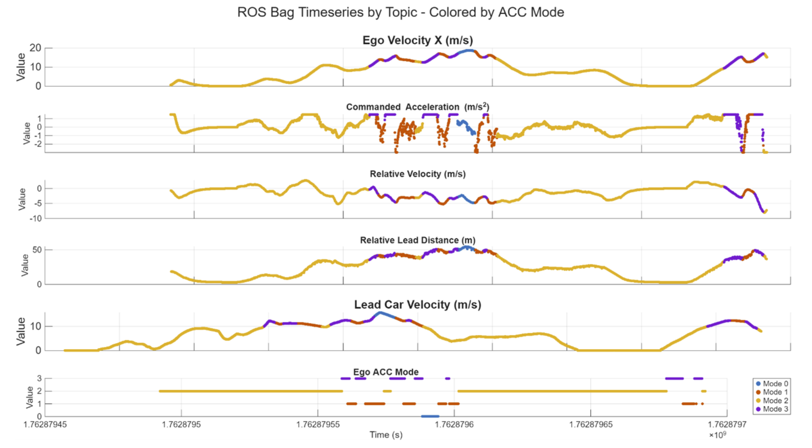
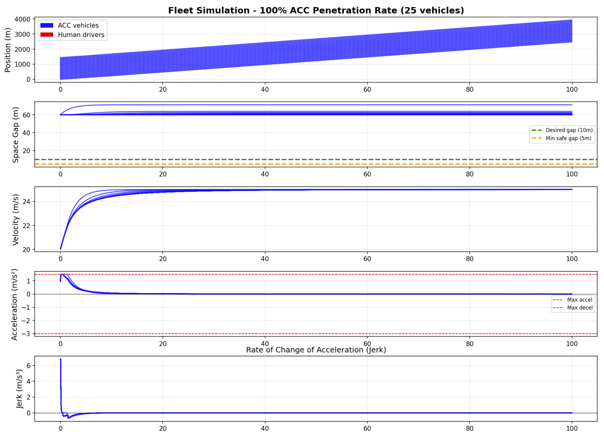
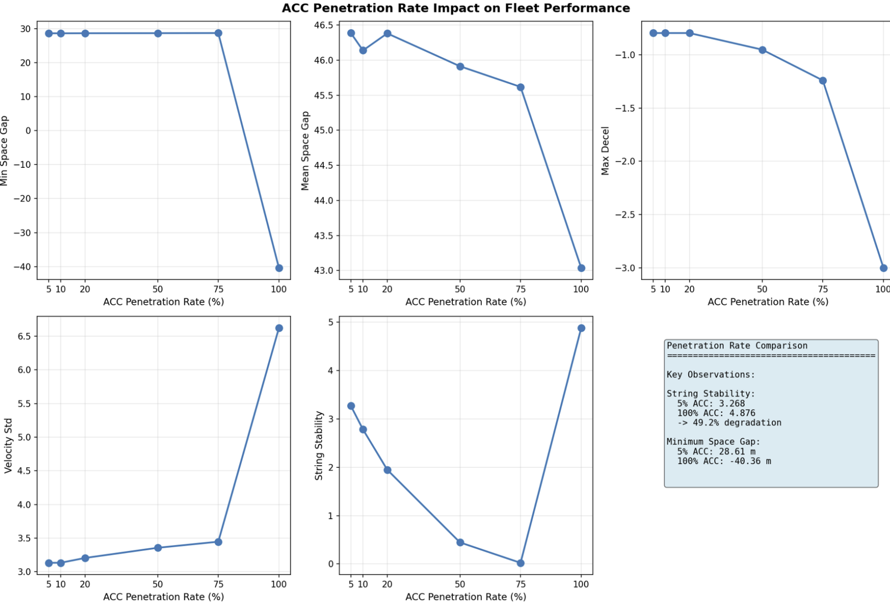
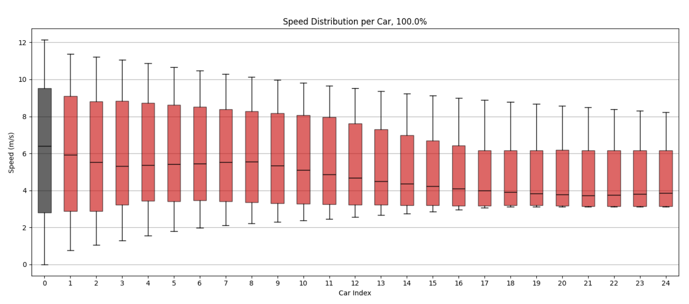
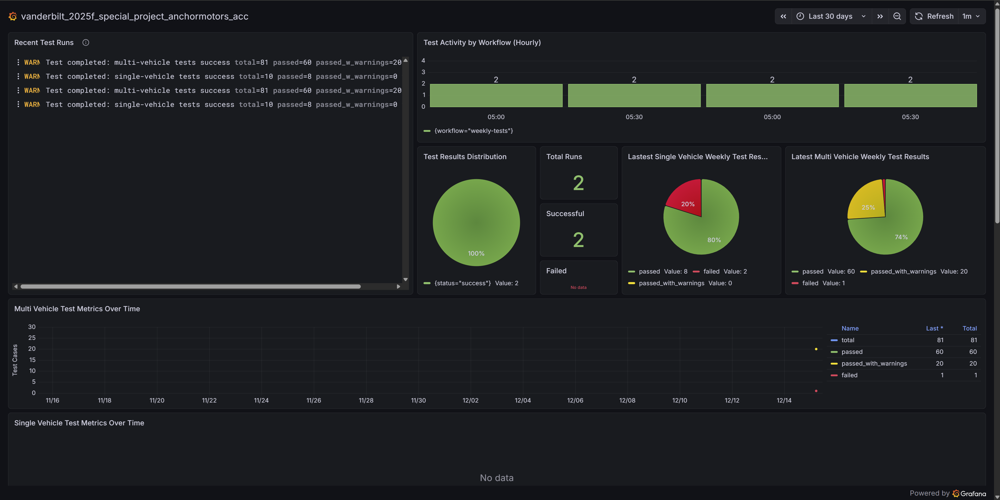

# Traffic State-Based Adaptive Cruise Control

An intelligent ACC system that classifies traffic states and dynamically adjusts control strategies to improve traffic flow, reduce stop-and-go waves, and enhance passenger comfort.

---

## Demo

<a href="https://youtu.be/8MEH_VP9whk?si=Rs65htik8K1zbWX8" target="_blank">
  
</a>

**<a href="https://youtu.be/8MEH_VP9whk?si=Rs65htik8K1zbWX8" target="_blank">Watch Road Test Video</a>**

---

## Overview

Standard ACC systems react only to the immediate vehicle ahead, amplifying phantom traffic jams and causing string-unstable conditions. Our Traffic State-Based ACC addresses this by:

- **Classifying traffic state** using onboard sensors to identify free-flow, entering congestion, in-wave, or exiting conditions
- **Adapting control strategy** dynamically based on classified state
- **Improving comfort** by mitigating hard-braking events

### Traffic State Classification

| Mode | State | Description |
|------|-------|-------------|
| 0 | No Wave | Free-flowing traffic or no lead vehicle |
| 1 | Into Wave | Vehicles slowing down, entering congestion |
| 2 | In Wave | Slow or stopped traffic |
| 3 | Out of Wave | Accelerating out of congestion |



### Control Equation

```
dv/dt = α(s - (τv + s_min)) + k·Δv
```



| Mode | α | τ | s_min | k |
|------|---|---|-------|---|
| No Wave | 0.15 | 2.0 | 10 | 0.424 |
| Into Wave | 0.7 | 2.4 | 10 | 0.23 |
| In Wave | 0.2 | 2.5 | 10 | 0.35 |
| Out of Wave | 1.1 | 2.4 | 10 | 0.24 |

---

## Performance Results

### Optimal Penetration Rate: 25-50%

| Penetration | String Stability | Safety | Comfort | Recommendation |
|-------------|-----------------|--------|---------|----------------|
| 5 - 25% | Moderate | Excellent | Excellent | Initial Rollout |
| 25 - 50% | Good | Excellent | Good | **Target Range** |
| 50 - 75% | Excellent | Good | Degrading | Needs Tuning |
| 100% | Catastrophic | Crashes | Poor | Not Recommended |

**Key Finding:** Mixed fleets outperform homogeneous fleets. Human drivers provide crucial damping at high penetration rates.

**ROS/Docker test after road test improvements**



**Synthetic Simlation: String stability at 100% penetration rate under certain conditions**



**Synthetic Simulation: Stable performance until penetration exceeds 75%**



**NGSIM Simulation:  Time space diagram, 50% penetration**


**NGSIM Simulation:  Time space diagram, 100% penetration**


**Speed distributions, 100% penetration**



---

## Requirements

- **MATLAB 2025b** (or 2025a with `.r2025a` files)
- Toolboxes: Simulink, MATLAB Report Generator, Control System Toolbox, Simulink Control Design, DSP System Toolbox

---

## Testing

**86 test cases** across two suites with automated PDF report generation.

### Single Vehicle Tests (10 cases)
```matlab
run('test/single_veh_test/run_all_single_test.m')
```

### Multi Vehicle Tests (76 cases)
```matlab
run('test/multi_veh_test/run_all_multi_test.m')
```

### Large-Scale Simulations
Python-based fleet simulations with NGSIM data. See [`test/large_scale/README.md`](test/large_scale/README.md).

---

## CI/CD Pipeline

Automated testing via GitHub Actions with Grafana monitoring.



**[View Live Dashboard](https://pmq9.grafana.net/public-dashboards/09e1212bd2f5467d9a5c53ad9e4237c3)**

See [`.github/CI_CD_SETUP.md`](.github/CI_CD_SETUP.md) for setup details.

---

## Team

| Name | Responsibilities |
|------|------------------|
| **Daechul Jung** | Into Wave / Exit Wave Control, Road Test Analysis |
| **Quang Pham** | CI/CD Pipeline, In Wave / No Wave Control, Fleet Testing |
| **Kate Sanborn** | Classification Subsystem, NGSIM Simulations, ROS Integration |

---

## References

1. FHWA, "Next Generation Simulation (NGSIM) Program" - [Link](https://ops.fhwa.dot.gov/trafficanalysistools/ngsim.htm)
2. M. Treiber, "The Intelligent-Driver Model" - [Link](https://traffic-simulation.de/info/info_IDM.html)

---

<p align="center">
Vanderbilt University | CS 5892: Projects in Autonomous Vehicles and Traffic | 2025
</p>
